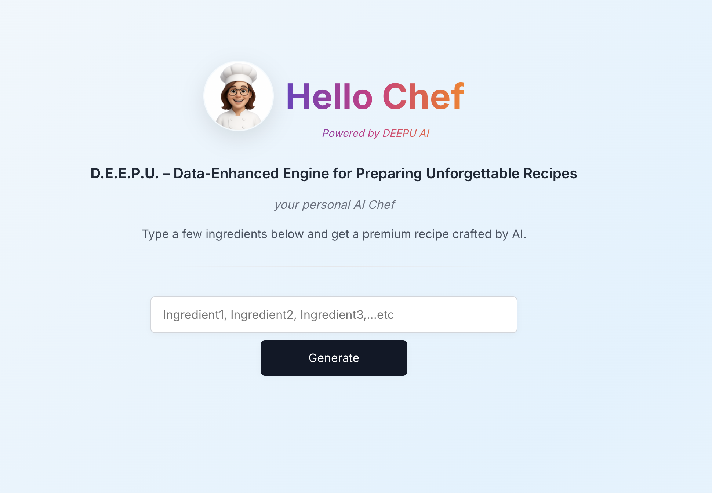

# DEEPU – Your AI Recipe Companion

DEEPU (Data-Enhanced Engine for Preparing Unforgettable Recipes) is a modern, serverless web application that transforms your available ingredients into intelligent, personalized recipes using generative AI.

Built with Amazon Bedrock, AWS Lambda, AppSync, and Cognito, DEEPU integrates advanced AI capabilities into a seamless culinary experience — all within a fully serverless architecture.

---

## What Does DEEPU Do?

DEEPU empowers users to input a list of ingredients and receive a fully structured, high-quality recipe crafted by artificial intelligence. Whether you're a home cook or simply looking to reduce food waste, DEEPU intelligently interprets your input and returns creative, delicious meal ideas in seconds.

---

## Live Application

Access the live application here:  
[https://main.d2dglaytcfnhl3.amplifyapp.com](https://main.d2dglaytcfnhl3.amplifyapp.com)

---

## Key Features

- AI-generated recipes based on your input ingredients
- Ingredient recognition and intelligent pairing
- Personalized recipe instructions and summaries
- Serverless deployment with full scalability
- User authentication via AWS Cognito

---

## Application Preview

A clean and intuitive user interface designed to deliver an elegant and focused cooking experience, powered by AI.

---

## Architecture Overview

---

## Get Involved

DEEPU is evolving. If you're interested in contributing features, refining the AI experience, or collaborating on future enhancements, you're welcome to connect and get involved.

---

DEEPU – Intelligent cooking, reimagined.
